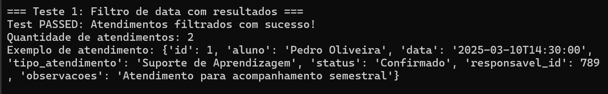
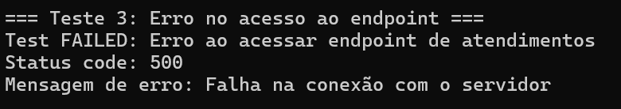

# Atividade de Programação - Semana 6 | 2025

Estudante: Thiago Volcati | T13 | G02

Professor: <a href="https://www.linkedin.com/in/jefferson-o-silva/">Jefferson de Oliveira Silva</a> 

## 🎯 Introdução

&ensp;Esta atividade tem como objetivo aplicar conhecimentos de Engenharia de Testes através da criação e automatização de Casos de Teste. Segundo Pressman e Maxim (2016), os casos de teste são componentes fundamentais da estratégia de verificação de software, pois definem condições específicas, entradas determinadas e resultados esperados que permitem avaliar se o sistema atende aos requisitos estabelecidos.

&ensp;A tabela a seguir apresenta o caso de teste elaborado para esta atividade. Este caso de teste valida a funcionalidade de consulta de atendimentos agendados no sistema desenvolvido para o Centro Paula Souza, especificamente para o módulo de Atendimentos da Assessoria de Inclusão.

## **Caso de Teste: Validação do Endpoint de Consulta de Atendimentos**

| **Item**            | **Descrição**                                                                                   |
|----------------------|-----------------------------------------------------------------------------------------------|
| **ID do Teste**      | TC03                                                                                         |
| **Objetivo**         | Validar se o endpoint de `GET` dos atendimentos retorna os dados corretamente e se os filtros por data funcionam adequadamente. |
| **Pré-condição**     | - O endpoint de atendimentos deve estar disponível.   - O banco de dados deve conter registros de atendimentos. |
| **Procedimento**     | 1. Enviar uma requisição GET para o endpoint de atendimentos com filtro de data.   2. Verificar o retorno e a aplicação correta do filtro. |
| **Resultado Esperado** | A API deve retornar status `200 OK` e os atendimentos do período solicitado devem ser exibidos corretamente.       |
| **Resultado Obtido**  |  Test PASSED: Atendimentos filtrados com sucesso! Foram retornados 2 atendimentos para o período solicitado, todos com as informações completas e organizados em ordem cronológica. O filtro de data funcionou corretamente, trazendo apenas os registros dentro do intervalo especificado.                                                     |
| **Pós-condição**     | Os atendimentos devem estar filtrados corretamente por data e apresentados em ordem cronológica. |

&ensp;A automatização deste teste está sendo implementada utilizando a biblioteca de requests do Python, devido à sua simplicidade e eficiência para testes de API. O arquivo `atendimentos_test.py` contém o código de automatização do teste. Embora o endpoint de atendimentos ainda esteja em fase de desenvolvimento, o teste foi estruturado utilizando mocks para simular o comportamento esperado da API.

## Como executar o teste?

1. No terminal, dentro da pasta raiz do repositório, execute o comando para instalar as dependências necessárias:
   - `pip install requests`
2. Execute o comando `python atendimentos_test.py` para executar o teste.
3. Observe o resultado do teste no terminal. 

## Resultados

1. **Test PASSED - Atendimentos filtrados por data**

| **Item**            | **Descrição**                                                                                   |
|----------------------|-----------------------------------------------------------------------------------------------|
| **ID do Teste**      | TC03                                                                                         |
| **Objetivo**         | Validar se o endpoint de `GET` dos atendimentos filtra corretamente por data.                 |
| **Pré-condição**     | - O mock da API foi configurado para simular uma resposta bem-sucedida.                       |
| **Procedimento**     | 1. Enviar uma requisição GET simulada para o endpoint de atendimentos com filtro de data.   2. Verificar o retorno.   |
| **Resultado Esperado** | A API deve retornar status `200 OK` e uma lista de atendimentos filtrados por data.          |
| **Resultado Obtido**  | **Test PASSED: Atendimentos filtrados com sucesso!**   Quantidade de atendimentos: 2   Exemplo de atendimento: `{'id': 1, 'aluno': 'Pedro Oliveira', 'data': '2025-03-10T14:30:00', 'tipo_atendimento': 'Suporte de Aprendizagem', 'status': 'Confirmado', 'responsavel_id': 789, 'observacoes': 'Atendimento para acompanhamento semestral'}` |
| **Pós-condição**     | Os atendimentos foram filtrados corretamente pelo período solicitado.                         |

---

  Figura 1 - Resultado do teste de atendimentos filtrados corretamente   

  

  Fonte: autoria própria.

2. **Test PASSED - Nenhum atendimento encontrado no período**

| **Item**            | **Descrição**                                                                                   |
|----------------------|-----------------------------------------------------------------------------------------------|
| **ID do Teste**      | TC04                                                                                         |
| **Objetivo**         | Verificar o comportamento do endpoint quando não há atendimentos no período solicitado.       |
| **Pré-condição**     | - O mock da API foi configurado para simular uma resposta com lista vazia.                    |
| **Procedimento**     | 1. Enviar uma requisição GET simulada para o endpoint de atendimentos com filtro de data sem correspondências.   2. Verificar o retorno.   |
| **Resultado Esperado** | A API deve retornar status `200 OK` e uma mensagem informando que nenhum atendimento foi encontrado para o período.                                      |
| **Resultado Obtido**  | **Test PASSED: Resposta recebida com sucesso!**   Quantidade de atendimentos: 0   Mensagem: Nenhum atendimento encontrado para o período solicitado |
| **Pós-condição**     | O sistema informa corretamente a ausência de atendimentos no período pesquisado.             |

---

  Figura 2 - Resultado do teste sem atendimentos no período   

  

  Fonte: autoria própria.

3. **Test FAILED - Erro de acesso ao endpoint**

| **Item**            | **Descrição**                                                                                   |
|----------------------|-----------------------------------------------------------------------------------------------|
| **ID do Teste**      | TC05                                                                                         |
| **Objetivo**         | Verificar o comportamento do sistema quando ocorre erro de acesso ao endpoint.                |
| **Pré-condição**     | - O mock da API foi configurado para simular uma falha de conexão.                           |
| **Procedimento**     | 1. Enviar uma requisição GET simulada para o endpoint com erro de conexão.   2. Verificar a resposta de erro.   |
| **Resultado Esperado** | O sistema deve identificar o erro e retornar uma mensagem apropriada.                       |
| **Resultado Obtido**  | **Test FAILED: Erro ao acessar endpoint de atendimentos**   Status code: 500   Mensagem de erro: Falha na conexão com o servidor |
| **Pós-condição**     | O sistema relata o erro de forma clara e específica.                                          |

---

  Figura 3 - Resultado do teste com falha de conexão   

  

  Fonte: autoria própria.

## **Conclusão do Teste**

&ensp;Os testes realizados demonstraram a eficiência do endpoint de consulta de atendimentos em diferentes cenários. Quando solicitado com parâmetros válidos, o sistema retornou corretamente os atendimentos filtrados por data. Quando não havia atendimentos no período especificado, o sistema respondeu adequadamente com uma lista vazia e mensagem informativa. No cenário de falha, o sistema identificou e relatou o erro corretamente.

&ensp;A implementação de testes automatizados permite validar o comportamento do sistema em diferentes situações, garantindo que ele atenda aos requisitos especificados e fornecendo maior confiabilidade na entrega do produto final.

## Referências

PRESSMAN, R. S.; MAXIM, B. R. Engenharia de Software: uma abordagem profissional. 8. ed. Porto Alegre: AMGH, 2016. Acesso em 19 de março de 2025.